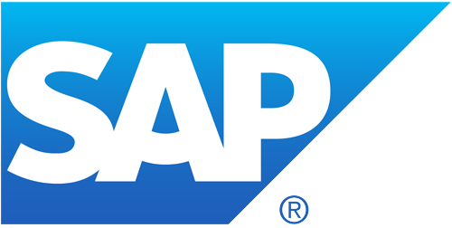

<p align="center">
  
</p>

  

### SAP Cloud Application Programming Model (CAP) Bootcamp

---

# OData Exercises

This repository contains exercises related to OData services, developed as part of the SAP CAP Bootcamp at Globant. The exercises are based on the Northwind OData service and demonstrate queries to retrieve and manipulate data.

## Overview

The goal of these exercises is to familiarize with OData queries by solving specific scenarios.  
The Northwind OData service is used as the data source:  
[https://services.odata.org/northwind/northwind.svc/](https://services.odata.org/northwind/northwind.svc/)

## Exercises

1. **Retrieve orders with customer details.**
2. **Retrieve employees who report to the manager with ID "2".**
3. **Retrieve products that are in stock (inventory).**
4. **Retrieve only the names and codes of products that are NOT in stock.**
5. **Retrieve the 5 most expensive products.**
6. **Find orders that were shipped to "Germany".**
7. **Retrieve only the names and prices of products in the "Beverages" category.**

## How to Use

1. Clone this repository:
   ```bash
   git clone https://github.com/Ash19-88/globant-sap-cap-odata.git
   cd globant-sap-cap-odata
   ```

## Notes

**Base URL: The base URL for all requests is https://services.odata.org/northwind/northwind.svc/.**  
**Replace {{baseUrl}} in each request with the actual base URL when making requests.**  
**Use Postman, Thunder Client, Insomnia or any preferred HTTP client to run these requests.**

## Tools and Technologies

**OData Services: Querying Northwind data using OData protocols.**  
**SAP CAP (Cloud Application Programming): Framework for building applications on SAP's Business Technology Platform (BTP).**

## Resources

- [OData Documentation](https://www.odata.org/getting-started/)
- [Northwind OData Service](https://services.odata.org/northwind/northwind.svc/)
- [SAP CAP Documentation](https://cap.cloud.sap/docs/)

## License

This project is for educational purposes as part of the Globant SAP CAP Bootcamp.

## Feel free to adjust this according to your preferences or requirements!
